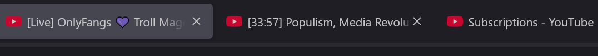
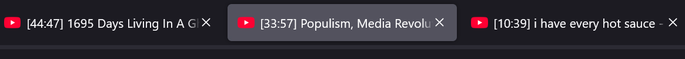

# video-duration-title-prefix
Userscript to prefix the YouTube tab title with the SponsorBlock duration or the video duration if SponsorBlock is unavailable. Prefix is `[Live]` for livestream content.

Screenshots
------------
Example result for a Livestream, Video, and Non-Video content respectively.

Example demonstration of my use case, making it easier to order videos by length, to more quickly reduce the number of open tabs by watching shorter content first.

Installation
------------

First, install a plugin that enables UserScript. There are several plugins for each web browser:

- Chrome or Firefox: [Tampermonkey](https://www.tampermonkey.net/)
- Firefox: [Greasemonkey](https://addons.mozilla.org/en-US/firefox/addon/greasemonkey/)

Then, [click here to install](https://gist.github.com/HaroldPetersInskipp/f6890b6d06883323d7d272f879c3ec06/raw/2571817656766b514745efa8425bb4b0b7dc4fa7/video-duration-title-prefix.user.js).
